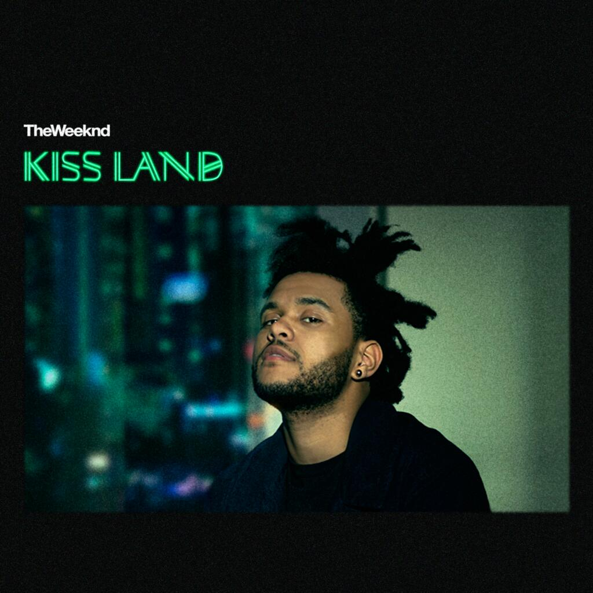

# My Song Assignment

**Song:** The Town  
**Artist:** The Weeknd

## Why I Chose This Song

*I chose this song because I like the music and lyrics. I also like The Weeknd as an artist.*

### Things I Like About It

- The lyrics
- The beat
- The artist
 
## <ins>My favourite part</ins>

## Lyrics

I haven't been around my town in a long while   
I apologize, but I  
I've been trying to get this money like I got a couple kids who rely  
On me  
But I remember on the bathroom floor  
'Fore I went on tour  
Like you said we couldn't do it again  
Cause you had a thing with some other man  
You said it was love  
And you said you were lost  
Then you wished me good luck  
To find somebody to love  
But, oooh  
Now I've heard that you're single  
And uh huh, I'll give you something to live for  
Yes, I will  

## Song Image

[Listen to the song on YouTube](https://www.youtube.com/watch?v=c7GkZd7T3tk)
